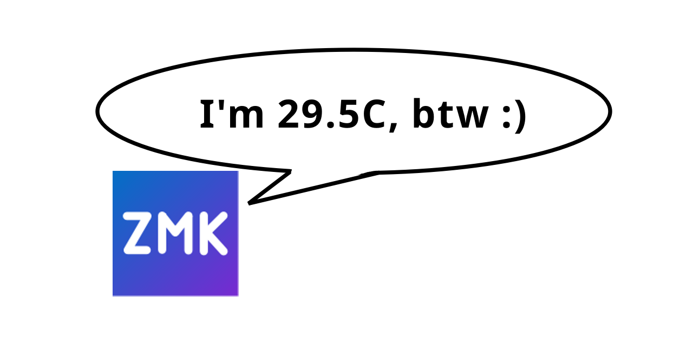

# ZMK Sensor Printer Behavior



A ZMK behavior that types out the value of a sensor by pressing keys one by one.

Project status: **One off joke but fully funtional**.  
I *may* fix bugs if it's not too much work. If this module somehow breaks your keyboard you should probably just remove it.

Keys used are `N1` to `N0`, `MINUS` for negative sign, and configurable `DOT` for decimal point.

## Import into your ZMK build

See <https://zmk.dev/docs/features/modules> for instructions on how to import this module into your ZMK build.

Due to ZMK's built-in behaviors' initialization priority being much earlier than sensors and this behavior, if you want to reference this behavior in other behaviors (like tap-dances and macros), you need to add the following line to your `config/<name>.conf` as a workaround:

```conf
CONFIG_SENSOR_INIT_PRIORITY=40
```

Everything is run on the central side. Printing the value of a sensor on the peripheral side is not supported.

## Usage

There are 3 presets provided for your convenience:

- `preset_temp_nrf.dtsi`: Print the die temperature of a nRF chip.
- `preset_temp_rp2040.dtsi`: Print the die temperature of a RP2040 chip.
- `preset_soc_vbatt.dtsi`: Print the State of Charge (SoC) from a sensor labeled `&vbatt`.

```dts
#include <behaviors.dtsi>
#include <dt-bindings/zmk/keys.h>
#include <dt-bindings/behavior-sensor-printer/preset_temp_nrf.dtsi>

/ {
    macros {
        print_temp_btw: print_temp_btw {
            compatible = "zmk,behavior-macro";
            wait-ms = <5>;
            tap-ms = <5>;
            #binding-cells = <0>;
            bindings = <&kp LS(I) &kp SQT &kp M &kp SPACE>,
                       <&macro_tap_time 200 &print_temp &macro_tap_time 5>,
                       <&kp LS(C) &kp COMMA &kp SPACE &kp B &kp T &kp W>,
                       <&kp SPACE &kp COLON &kp RPAR>;
        };
    };
};

/ {
    keymap {
        compatible = "zmk,keymap";

        default_layer {
            bindings = <&print_temp_btw>;
        };
    };
};
```

## Defining custom sensor printer

See [`zmk,behavior-sensor-printer.yaml`](./dts/bindings/behaviors/zmk,behavior-sensor-printer.yaml) for the full list of properties, should be pretty self-explanatory.

See [`sensor_channel.h`](./include/dt-bindings/behavior-sensor-printer/sensor_channel.h) and Zephyr docs for the list of available sensor channels.

Make sure you don't label your behavior as common words like `temp` or `vbatt` as those are commonly used by the sensors themselves.

Full example:

```dts
#include <dt-bindings/zmk/keys.h>
#include <dt-bindings/behavior-sensor-printer/sensor_channel.h>

print_temp: print_temp {
    compatible = "zmk,behavior-sensor-printer";
    #binding-cells = <0>;
    sensor = <&temp>;
    channel = <SENSOR_CHAN_DIE_TEMP>;
    decimal-places = <1>;
    decimal-separator = <COMMA>;
};
```
